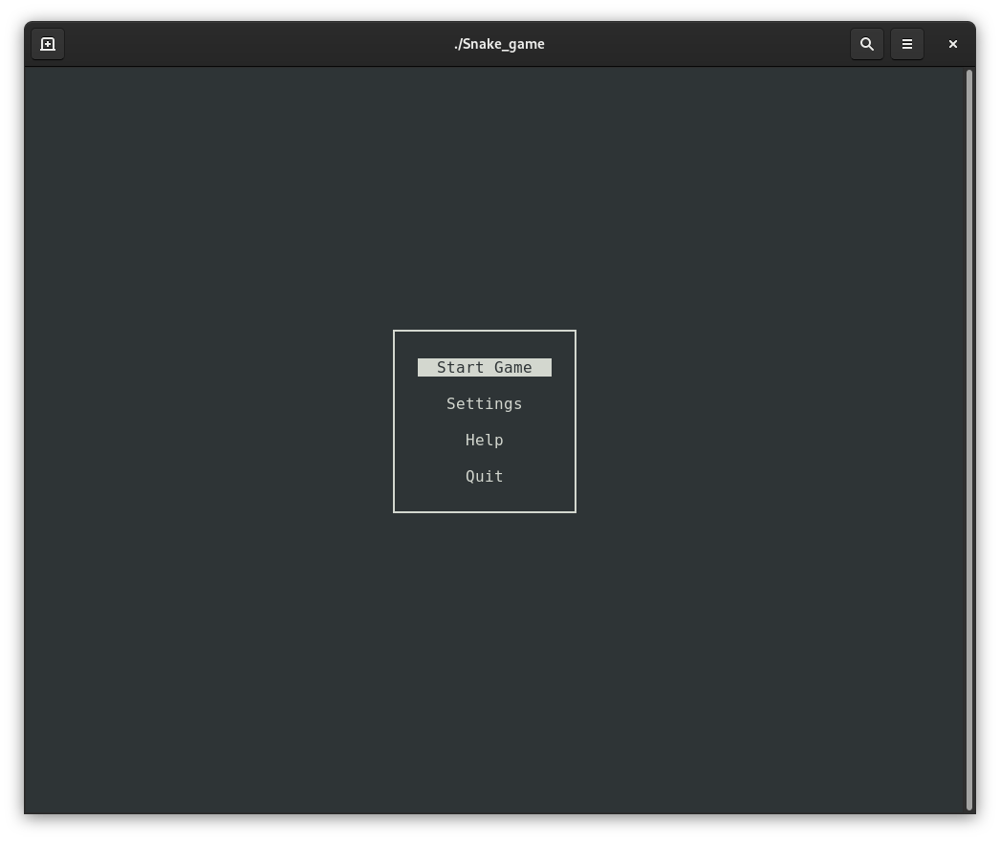
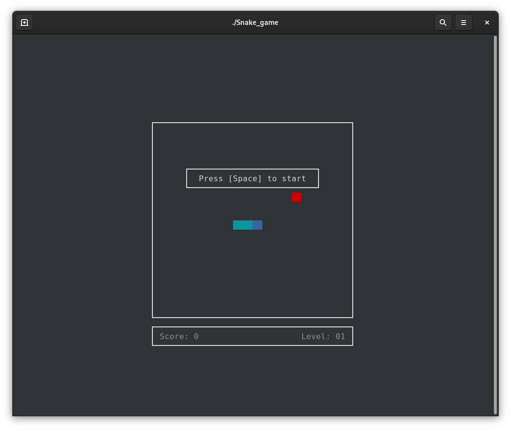
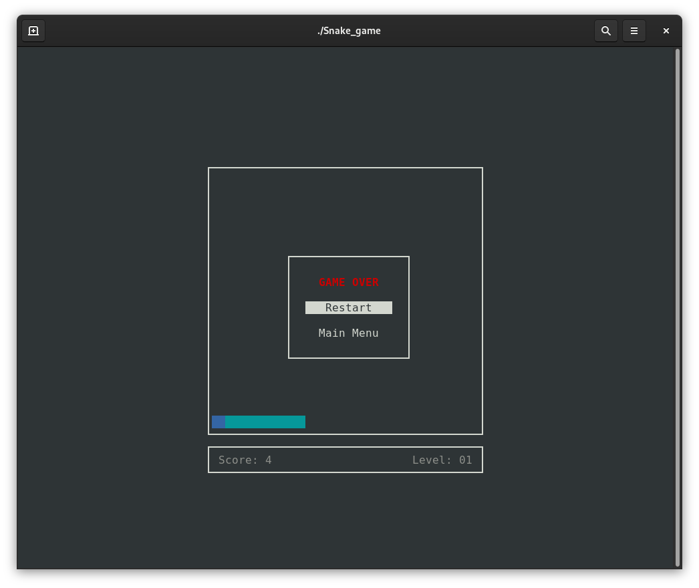

# Snake game

This is a program I wrote for the simple reason of learning and practice.

## Description

This is a basic Snake game. The program runs in console (using ncurses). In settings menu you can choose from several playground sizes and starting speeds. The goal of the game is to "eat" as many fruits as you can. Game is over when snake collides with a wall or with itself. Game can be paused using [Space] key and can be ended using [q]. The speed of the snake will increment periodicaly during the game, until it reaches 10, to make it more challanging.

**NOTE:** At the moment, the program is unable to handle if the window is resized or if it is too small, so make sure you have a big enough window open before running the program.

## Compiling

Project can be built for Linux systems using Premake. Available for download here: https://premake.github.io/

Run `premake5 gmake2` command from the root folder to generate Makefile based on the premake5.lua script file.

Running `make` will build the Debug version. For building Release version run `make config=release`.

It will use available g++ compiler which needs to support C++17.

## Dependencies

Compiler will link ncurces libraries (`libncurses.a` and `ibncurses_g.a` for the debug version). Available for download here: https://invisible-island.net/ncurses/ncurses.html